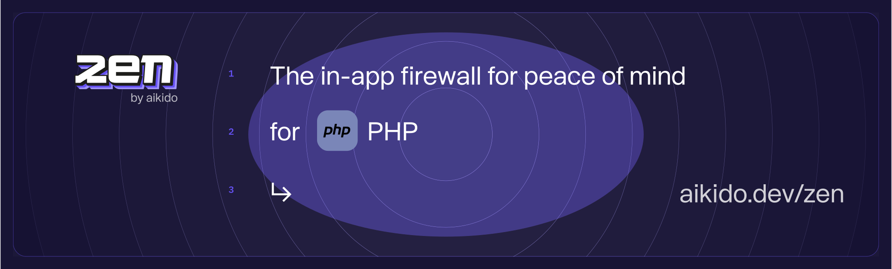

# Zen, in-app firewall for PHP | by Aikido

Zen, your in-app firewall for peace of mind – at runtime.

Zen is an embedded Web Application Firewall that autonomously protects your PHP apps against common and critical attacks.

Zen protects your PHP apps by preventing user input containing dangerous strings, thus protecting agains attacks like SQL injection. It runs on the same server as your PHP app for simple [install](#Install) and zero maintenance.

## Features

Zen will autonomously protect your PHP applications from the inside against:

* 🛡️ [SQL injection attacks](https://www.aikido.dev/blog/the-state-of-sql-injections)
* 🛡️ [Command injection attacks](https://www.aikido.dev/blog/command-injection-in-2024-unpacked)
* 🛡️ [Path traversal attacks](https://owasp.org/www-community/attacks/Path_Traversal)
* 🛡️ [Server-side request forgery (SSRF)](./docs/ssrf.md)

Zen operates autonomously on the same server as your PHP app to:

* ✅ Secure your app like a classic web application firewall (WAF), but with none of the infrastructure or cost.
* ✅ Rate limit specific API endpoints by IP or by user
* ✅ Allow you to block specific users manually

## Install

Zen for PHP comes as a single package that needs to be installed on the system to be protected.

Prerequisites:
* Ensure you have sudo privileges on your system.
* Check that you have a supported PHP version installed (PHP version >= 7.3 and tested up to 8.4).
* Make sure to use the appropriate commands for your system or cloud provider.

### Manual install

#### For Red Hat-based Systems (RHEL, CentOS, Fedora)

```
rpm -Uvh --oldpackage https://github.com/AikidoSec/firewall-php/releases/download/v1.0.111/aikido-php-firewall.x86_64.rpm
```

#### For Debian-based Systems (Debian, Ubuntu)

```
curl -L -O https://github.com/AikidoSec/firewall-php/releases/download/v1.0.111/aikido-php-firewall.x86_64.deb
dpkg -i -E ./aikido-php-firewall.x86_64.deb
```

We support Debian >= 11 and Ubuntu >= 20.04.
You can run on Debian 10, by doing this setup before install: [Debian10 setup](./docs/debian10.md)

- [Caddy & PHP-FPM](./docs/caddy.md)
- [Apache mod_php](./docs/apache-mod-php.md)

### Managed platforms

- [Laravel Forge](./docs/laravel-forge.md)
- [AWS Elastic beanstalk](./docs/aws-elastic-beanstalk.md)
- [Fly.io](./docs/fly-io.md)

### Troubleshooting

[Read our troubleshooting documentation.](./docs/troubleshooting.md)

## Supported libraries and frameworks

### PHP versions
Zen for PHP supports the following PHP versions: 7.3, 7.4, 8.0, 8.1, 8.2, 8.3, 8.4.

### Web frameworks

Zen for PHP is Web-framework agnostic, meaning that it will work on any PHP Web framework that you want to use.

Zen for PHP can do this because the monitored functions are hooked at the PHP-core level.

### Database drivers
* ✅ [`PDO`](https://www.php.net/manual/en/book.pdo.php)
    * ✅ [`MySQL`](https://www.php.net/manual/en/ref.pdo-mysql.php)
    * ✅ [`Oracle`](https://www.php.net/manual/en/ref.pdo-oci.php)
    * ✅ [`PostgreSQL`](https://www.php.net/manual/en/ref.pdo-pgsql.php)
    * ✅ [`ODBC and DB2`](https://www.php.net/manual/en/ref.pdo-odbc.php)
    * ✅ [`Firebird`](https://www.php.net/manual/en/ref.pdo-firebird.php)
    * ✅ [`Microsoft SQL Server`](https://www.php.net/manual/en/ref.pdo-dblib.php)
    * ✅ [`SQLite`](https://www.php.net/manual/en/ref.pdo-sqlite.php)
* 🚧 [`MySQLi`](https://www.php.net/manual/en/book.mysqli.php)
* 🚧 [`Oracle OCI8`](https://www.php.net/manual/en/book.oci8.php)
* 🚧 [`PostgreSQL`](https://www.php.net/manual/en/book.pgsql.php)
* 🚧 [`SQLite3`](https://www.php.net/manual/en/book.sqlite3.php)

### Outgoing requests libraries
* ✅ [`cURL`](https://www.php.net/manual/en/book.curl.php)
  * Including wrappers, when configured to use cURL as adapter:
    * ✅ [`GuzzleHttp`](https://docs.guzzlephp.org/en/stable/)
    * ✅ [`HTTP_Request2`](https://pear.php.net/package/http_request2)
    * ✅ [`Symfony\HTTPClient`](https://symfony.com/doc/current/http_client.html)
* ✅ [`file_get_contents`](https://www.php.net/manual/en/function.file-get-contents.php)

## Reporting to your Aikido Security dashboard

> Aikido is your no nonsense application security platform. One central system that scans your source code & cloud, shows you what vulnerabilities matter, and how to fix them - fast. So you can get back to building.

Zen is a new product by Aikido. Built for developers to level up their security. While Aikido scans, get Zen for always-on protection. 

You can use some of Zen’s features without Aikido, of course. Peace of mind is just a few lines of code away.

But you will get the most value by reporting your data to Aikido.

You will need an Aikido account and a token to report events to Aikido. If you don't have an account, you can [sign up for free](https://app.aikido.dev/login).

Here's how:
* [Log in to your Aikido account](https://app.aikido.dev/login).
* Go to [Zen](https://app.aikido.dev/runtime/services).
* Go to apps.
* Click on **Add app**.
* Choose a name for your app.
* Click **Generate token**.
* Copy the token.
* Set the token as an environment variable, `AIKIDO_TOKEN`

## Running in production (blocking) mode

By default, Zen will only detect and report attacks to Aikido.

To block requests, set the `AIKIDO_BLOCK` environment variable to `true`.

See [Reporting to Aikido](#reporting-to-your-aikido-security-dashboard) to learn how to send events to Aikido.

## Additional configuration

[Configure Zen using environment variables for authentication, mode settings, debugging, and more.](https://help.aikido.dev/doc/configuration-via-env-vars/docrSItUkeR9)

## Benchmarks

Zen for PHP benchmarks are splitted into 2 categories:
* Benchmarks for single PHP operations (function calls) that are monitored by Zen
* Benchmarks for round-trip requests to PHP apps protected by Zen

We do automated benchmarks on each new version and we store the result in the repo. If you need some specific benchmarks for (OS, PHP version) pairs, check the [benchmarks](docs/benchmarks/) folder.

The benchmarking times displayed in this readme are computed with PHP 8.1 on the latest Ubuntu version.

### Benchmarks for PHP operations

| Benchmark | Avg. time w/o Zen | Avg. time w/ Zen | Delta |
|---|---|---|---|
| Shell Execution | 1.3139 | 1.3509 | 0.0370 ms |
| Path Access | 0.0129 | 0.0160 | 0.0031 ms |
| Outgoing Request | 0.1030 | 0.1321 | 0.0291 ms |
| Sql Query | 0.0138 | 0.0169 | 0.0031 ms |

### Benchmarks for PHP requests

| Benchmark | Avg. time w/o Zen | Avg. time w/ Zen | Delta |
|---|---|---|---|
| Request With Rate Limiting Enabled | 1.2310 | 1.6480 | 0.4170 ms |
| Request With User Setting | 1.2230 | 1.4430 | 0.2200 ms |
| Request Simple | 1.2370 | 1.3730 | 0.1360 ms |

## Uninstall

### Manual uninstall

#### For Red Hat-based Systems (RHEL, CentOS, Fedora)

```
rpm -e aikido-php-firewall
```

#### For Debian-based Systems (Debian, Ubuntu)

```
dpkg --purge aikido-php-firewall
```

## Bug bounty program

Our bug bounty program is public and can be found by all registered Intigriti users at: https://app.intigriti.com/researcher/programs/aikido/aikidoruntime

## Contributing

See [CONTRIBUTING.md](.github/CONTRIBUTING.md) for more information.

## Code of Conduct

See [CODE_OF_CONDUCT.md](.github/CODE_OF_CONDUCT.md) for more information.

## Security

See [SECURITY.md](.github/SECURITY.md) for more information.
